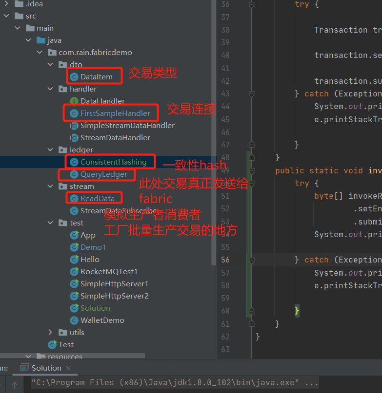

# nisl-fabric-sdk

本项目是一个java语言的fabric客户端sdk，用于发送交易。可以自动生成基于smallbank benchmark的交易，并采用一致性哈希算法将交易分配给各个链码。

## Quick Start

resources中的organizations需要替换为fabric网络的organizations。

connection.json中fabric网络所在地址需要修改。

fabricdemo.jar是该项目打包的记过，可以直接运行。

~~~bash
java -cp fabricdemo.jar com.rain.fabricdemo.test.App 1 200 10000
~~~

第一个参数代表分片数量，第二个参数代表发送线程数量，第三个参数代表发送交易数量。

## Architecture

架构如图：

## Other

smallbank-benchmark来源：https://github.com/hsj576/smallbank-benchmark

支持分片的fabric来源：https://github.com/hsj576/nisl-fabric/tree/sharding

